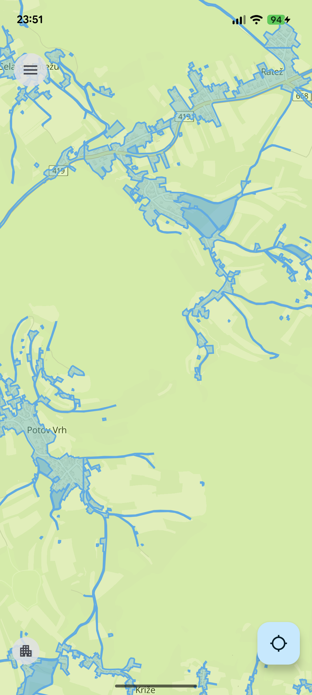
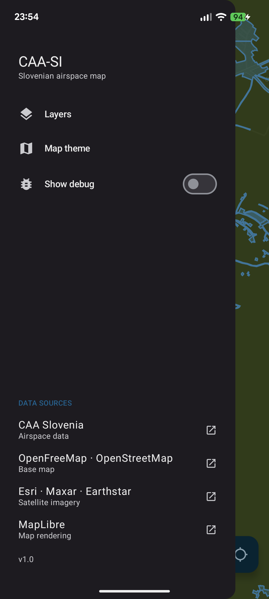
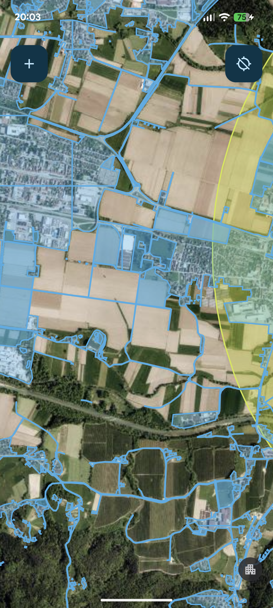

<div align="center">


# CaaSI

A small Android app for checking Slovenia's UAS (drone) geographical zones - the
restricted, limited and conditional airspace the CAA publishes - on an
interactive map.

</div>

---

CaaSI is a personal project: I wanted the drone-airspace zones from
[uas-geo.caa.si](https://uas-geo.caa.si) in a map I actually enjoy using,
instead of the official web viewer.

There's no backend of my own - it pulls everything at runtime from the CAA's
public ArcGIS service ([caa-slovenia.maps.arcgis.com](https://caa-slovenia.maps.arcgis.com))
as GeoJSON, and renders it with [MapLibre](https://maplibre.org) over free,
keyless [OpenFreeMap](https://openfreemap.org) tiles (and Esri World Imagery for
the satellite view).

## Screenshots

|                        Light                         |                        Dark                         |                        Satellite                         |
|:----------------------------------------------------:|:---------------------------------------------------:|:--------------------------------------------------------:|
|  |  |  |

## What it does

- **Airspace zones** - renders the UAS geographical zones as colored polygons and lines.
- **Layers** - toggle the different zone categories on and off.
- **Map themes** - System, Light, Dark, and a Satellite (aerial) themes.
- **Your location** - shows your position on the map.

**The data contract is fragile.** The CAA's ArcGIS layers, IDs and geometry can
change at any moment, and when they do the map can break until the parser
is fixed. A scheduled live-test job hits the real endpoints daily so drift shows
up early.

### Stack

Kotlin 2.3 · Jetpack Compose (Material 3) · Koin for DI · Moshi · OkHttp · Room
(layer/feature cache) · [MapLibre](https://maplibre.org) via
[ramani-maps](https://github.com/ramani-maps/ramani-maps) · OpenFreeMap + Esri
imagery · AGP 9. `minSdk` 26, `targetSdk` 37. Single `:app` module.

## Building

You'll need Android Studio (or just the SDK) and a JDK; the Gradle wrapper
handles the rest.

```bash
# install the debug build on a connected device/emulator
./gradlew :app:installDebug
```

The debug app installs as **CaaSI🐛** with a `.debug` suffix, so it sits happily
next to a release install.

### Tests

```bash
./gradlew test               # unit tests (offline)
./gradlew test -PliveTests   # live tests against the real CAA endpoints (network)
```

### Release builds

The release build is signed; the signing config is read from environment
variables to keep secrets out of the repo and play nicely with CI. Pushing a
`v*` tag triggers the release workflow, which builds and publishes signed APKs.
See [`RELEASE.md`](RELEASE.md) for keystore creation and the GitHub secrets.

```bash
export KEYSTORE_FILE=/path/to/release-key.jks
export KEYSTORE_PASSWORD=...
export KEY_ALIAS=...
export KEY_PASSWORD=...

./gradlew assembleRelease
```

## Disclaimer

CaaSI is an unofficial, non-commercial hobby project. It is not affiliated with
or endorsed by the Slovenian Civil Aviation Agency - it just displays their
public data. For official data, use the official source at
[uas-geo.caa.si](https://uas-geo.caa.si) and current NOTAMs.
